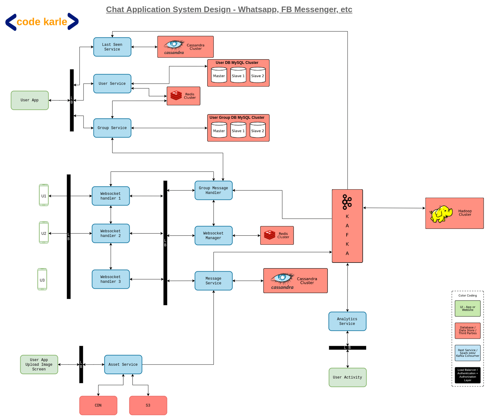

# The system operation flow is inspired by the model below

You can refer in github link: [Go to site](https://github.com/codekarle/system-design/tree/master/system-design-prep-material/architecture-diagrams)

And some refer from [ACE-the system interview design](https://towardsdatascience.com/ace-the-system-interview-design-a-chat-application-3f34fd5b85d0)



# How to start (may be later)
## Setup Docker
In root directory
### Setup Redis for User Mapping Service
```bash
docker run -d --name some-redis -p 6379:6379 redis
```

### Setup Mysql for User Service (maybe use later, this is optional)
```bash
docker run --name jmysql -e MYSQL_ROOT_PASSWORD=root -p 3307:3306 -d mysql:latest
```
### Setup Cassandra for message service
```code
./setup-config.sh
```
Run docker compose Cassandra it will be create 3 nodes as docker-compsose define
```code
docker-compose up
```

setup cassandra for sorting data:
```bash
$cqlsh:spring_cassandra> CREATE TABLE spring_cassandra.messages(id text, conversationId text, content text, recipientUserId bigint, authorUserId bigint, replyMessageId text, createdAt bigint, updatedAt bigint, isDeleted boolean, PRIMARY KEY(conversationId, createdat));
```
```bash
$cqlsh:spring_cassandra> CREATE TABLE spring_cassandra.conversations(id text, title text, participantuserids map<bigint,text>, owneruserid bigint, createdAt bigint, updatedAt bigint, isDeleted boolean, PRIMARY KEY((owneruserid), updatedat));

INSERT INTO conversations (id, owneruserid, createdat, updatedat, isdeleted, participantuserids, title) VALUES ('96045da2-00ab-46b3-824f-d1e86c98efe6', 276260728, 1, 1, False, {276260728: 'c947df16-38ba-48a3-974d-9faa437448cf', 276260729: 'c947df16-38ba-48a3-974d-9faa437448cg'}, 'conversation1');

INSERT INTO conversations (id, owneruserid, createdat, updatedat, isdeleted, participantuserids, title) VALUES ('96045da2-00ab-46b3-824f-d1e86c98efe7', 276260728, 3, 3, False, {276260728: 'c947df16-38ba-48a3-974d-9faa437448cg', 276260729: 'c947df16-38ba-48a3-974d-9faa437448ch'}, 'conversation2');
```
## Run Spring boot project

```code
```